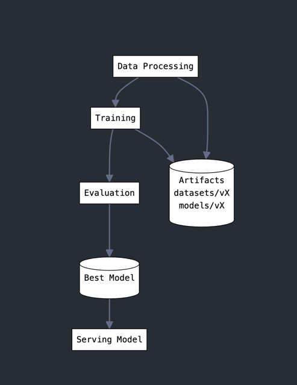

## Deploy a fine-tuned sentence transformer model

## High level design
### Architectural choices

Most of the choices I have made have come from the fact that I was training locally:
1. formatted and downsampled the training data: less than one triplet (query, positive, negative) per query_id
2. given the above, used TripletEvaluator along with MultipleNegativesRankingLoss for training
3. reduced maximum model sequence lenght to 64 (99th percentile of text lenght)
4. used pretrained model on asymmetric semantic search since query lenght < passage length
6. model evaluated on information retrieval metric NDCG@10 because It accounts for the ranking quality of results (essential for vector similarity search)

More insights from the exploratory data analysis conducted in *notebook* directory

### DAG
The fine-tuning flow is described by the DAG below:
1. model is fine-tuned
2. data and model artifacts are versioned and saved
3. evaluated against the current baseline, and if that's better, it's saved on disk to be served
4. created a web API that receive a query and a list of docs and returns the most relevant one





## Repo structure
```bash
.
├── Makefile                    # Build automation and task management
├── requirements.txt            # Project dependencies
├── README.md                   # Project documentation
│
├── src/                       # Source code directory
│   ├── data/                  # Data processing modules
│   │   ├── main/             # Main data processing scripts
│   │   └── utils/            # Utility functions for data processing
│   │
│   ├── train/                # Training modules
│   │   ├── main/             # Main training scripts 
│   │
│   ├── serve/                # Model serving components
│   │   ├── app/              # Application code
│   │   ├── Dockerfile        # Container definition
│   │   ├── docker-compose.yml # Container orchestration
│   │   ├── requirements/     # Service-specific dependencies
│   │   └── model/            # Best performing model
│   │
│   └── test/                 # Testing modules
│       ├── main/             # Main test scripts
│       └── utils/            # Test utilities
│
├── notebook/                  # Jupyter notebooks
│   ├── jupyter_notebook/     # EDA and analysis notebooks
│   └── README               # Notebook documentation
│
└── artifacts/                # Training artifacts
    ├── datasets/             # Dataset versions
    │   ├── V0/
    │   └── ...
    │
    └── models/               # Model versions
        ├── V0/
        └── ...
```

## How to
**Please note**: Ensure to have installed make and docker.
### Setting Up Virtual Environment
```bash
# Create virtual environment
make venv

# Activate the virtual environment (Unix/macOS)
source venv/bin/activate

# Install project dependencies
make install
```

### Fine tune
```bash
# Run individual steps
make data          # Process the data
make train         # Train the model
make test          # Run tests

# Or run the entire pipeline at once
make run-all       # Runs data processing, training, and testing in sequence
```

### Serve
```bash
# Build Docker images
make docker-build

# Start the services
make docker-up

# Stop the services
make docker-down

# Build and deploy in one command
make deploy
```


### Test serving
```bash
curl -X POST http://localhost:5000/find_similar \
-H "Content-Type: application/json" \
-d '{
  "query": "What is machine learning?",
  "documents": [
    "Machine learning is a branch of artificial intelligence.",
    "Biology is the study of living organisms.",
    "Physics deals with matter and energy."
  ]
}'

```
